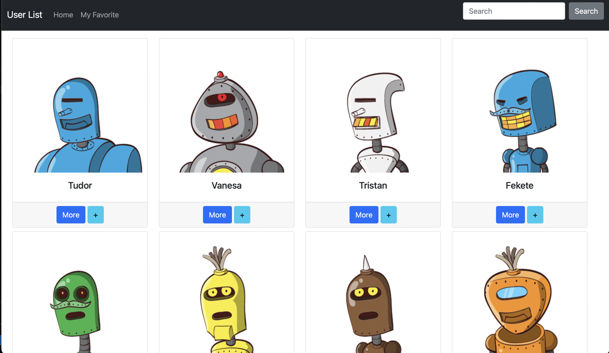
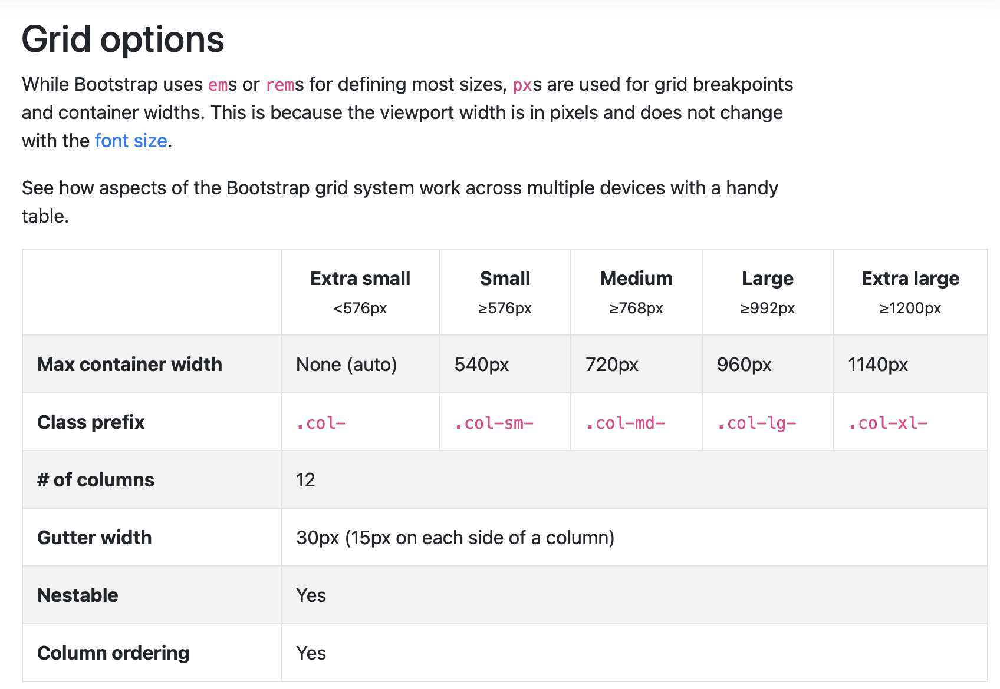

# Alpha Camp Dev C2 M4 - User listings with filtering solution.

This is a solution to the User listings with filtering.

## Table of contents

- [Overview](#overview)
  - [The challenge](#the-challenge)
  - [Screenshot](#screenshot)
  - [Links](#links)
- [My process](#my-process)
  - [Built with](#built-with)
  - [What I learned](#what-i-learned)
  - [Continued development](#continued-development)
  - [Useful resources](#useful-resources)
- [Author](#author)
- [Acknowledgments](#acknowledgments)

## Overview

### The challenge

Users should be able to:

- See All users in the page.
- Search and filter users by search bar.
- Add users to the favorite and see them in `favorite.html`

### Screenshot



### Links

- Solution URL: [https://github.com/Chious/Dev-C2-M4-User-List](https://github.com/Chious/Dev-C2-M4-User-List)
- Live Site URL: [https://chious.github.io/Dev-C2-M4-User-List/](https://chious.github.io/Dev-C2-M4-User-List/)

## My process

### Built with

- Semantic HTML5 markup
- [Boostrap5](https://getbootstrap.com) - useful design frame
- [Axios](https://github.com/axios/axios) - Get Promise from AJAX
- [Local Storage](https://developer.mozilla.org/en-US/docs/Web/API/Window/localStorage) - Save user's favorite

### What I learned

1. 需要跨頁面存取資料的時候，Local Storage 可以用來暫存使用者做過了哪些動作，不過要注意的是 Local Storage 只能存取字串。

```js
localStorage.setItem("變數名稱", "變數值"); //新增變數
localStorage.getItem("變數名稱"); //取得變數值
localStorage.removeItem("變數名稱"); //移除變數

// 常搭配的函數

JSON.parse(); // 將字串轉為陣列
JSON.stringify(); // 將值轉為字串
```

2. [Boostrap Grid](https://getbootstrap.com/docs/4.0/layout/grid/)：定義 row 或是 column 元素寬度時，可以直接在`class`中直接定義，例如：

```html
<div class="col-sm-3">col</div>
```

表示當裝置大小為`sm`時，該欄（column）每個元素只能佔該欄位的 25%（即滿版 12 份中的 3 份）



3. How to set up axios embedded in the `html` :

```html
<!--head-->
<link
  href="https://cdn.jsdelivr.net/npm/bootstrap@5.1.3/dist/css/bootstrap.min.css"
  rel="stylesheet"
  integrity="sha384-1BmE4kWBq78iYhFldvKuhfTAU6auU8tT94WrHftjDbrCEXSU1oBoqyl2QvZ6jIW3"
  crossorigin="anonymous"
/>
<!--body-->
<script src="https://cdn.jsdelivr.net/npm/axios/dist/axios.min.js"></script>
<script
  src="https://cdn.jsdelivr.net/npm/bootstrap@5.1.3/dist/js/bootstrap.bundle.min.js"
  integrity="sha384-ka7Sk0Gln4gmtz2MlQnikT1wXgYsOg+OMhuP+IlRH9sENBO0LRn5q+8nbTov4+1p"
  crossorigin="anonymous"
></script>
```

### 待迭代

1. `navbar`：搜尋列有些跟其他按鈕的垂直高度有些對不起來

2. `search bar`：可以加入 auto complete 方便搜尋。

3. `data panel`：

- 考慮改變卡片顏色樣式，讓整個頁面的色調比較一致。
- 可以把某些重要資訊（如：地區）做成 tag 放在卡片的外側，方便搜尋。

4. `Modal`：打開 Modal 讀取資料時會有點卡卡的，可以添加 setTimeout()，待載入完再打開。

5. `paginator`：標籤頁的 tag 有點太多，可以將其濃縮

### Useful resources

- [BoostrapGird](https://getbootstrap.com/docs/4.0/layout/grid/) - Help me understand how
  to set up element in the table
- [Auto Complete](https://codepen.io/Sinnemanie/pen/LBZqEr?fbclid=IwAR1_KUpKQMPr3gQMsOaGnhhYKne1gbJm3ZwAwOLyAE-Bpw2jllLvaK7h-2Q)- Some example of auto complete

## Author

- Github - [邱佳昇](https://github.com/Chious) ## Acknowledgments None
